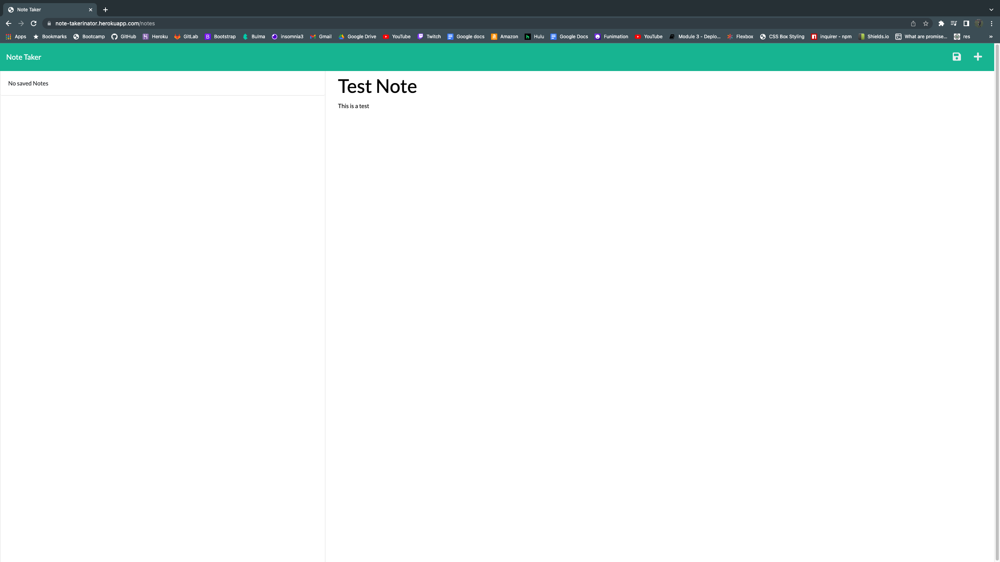
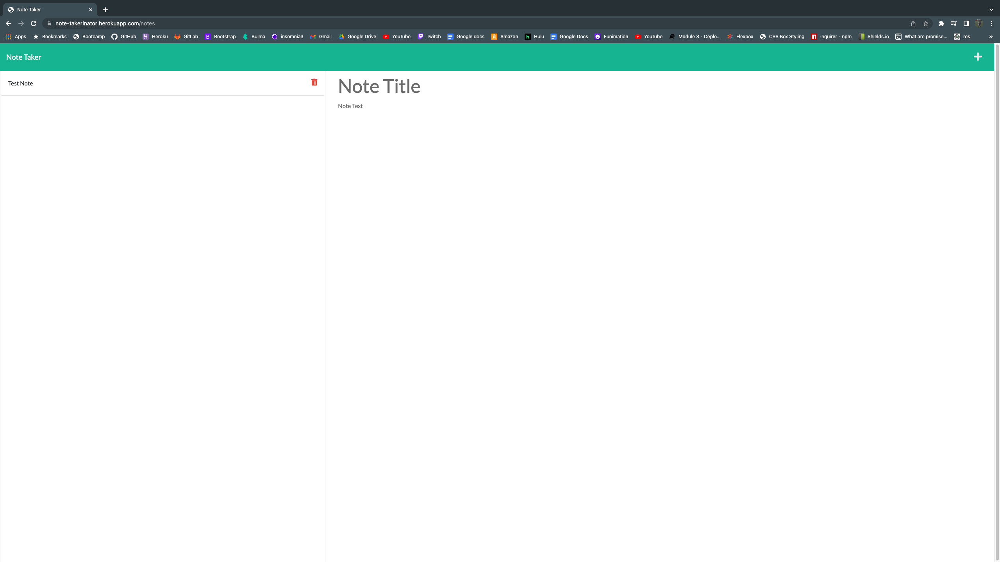

# note-takerinator

## Description

This is an application that will receive input for a note title and description, then the note should be saved through our backend using express.js and deployed with heroku.

# Table of Contents

* [Links](#links)

* [Questions](#questions)

# Links

[Github Repo URL](https://github.com/cavazosdotcom/note-taker)

[Heroku Live Deployment](https://note-takerinator.herokuapp.com/)

# Questions
If you have any questions feel free to contact me at either [Github](https://github.com/cavazosdotcom), or [cavazosdotcom@gmail.com](cavazosdotcom@gmail.com)  

